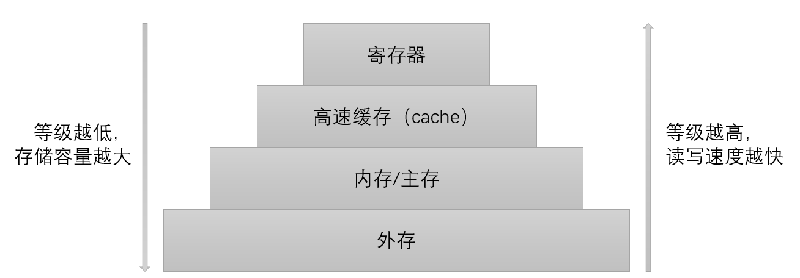

# 操作系统


## 3 内存管理

### 3.1 内存管理基础

#### 3.1.1 计算机存储体系

计算机存储体系如下：




#### 3.1.2 概念与功能

**内存管理：**操作系统对内存的划分和动态分配

内存管理的**主要功能：**

- 内存空间的分配与回收
- 地址转换：逻辑地址➡物理地址
- 内存空间的扩充：虚拟存储技术
- 内存共享：多个进程访问内存同一部分
- 存储保护：各个进程在各自存储空间运行，互不干扰

**进程的内存映像：**程序调入内存，构成了进程的内存映像，包含如下要素：

- 代码段：二进制代码，固定大小
- 数据段：固定大小
- 进程控制块（PCB）：固定大小
- 堆：存放动态分配的变量（malloc、free），动态大小
- 栈：实现函数调用，动态大小

**内存保护：**确保每个进程都有单独的内存空间，实现方法如下：

- 设置上、下限寄存器，定义程序在内存中的上下限地址
- 重定位寄存器和界地址寄存器：重定位寄存器用于地址重定位，界地址寄存器用于规定程序使用的内存空间大小，程序执行时访问地址，先与界地址寄存器比较，再经过重定位寄存器，进行地址转换

#### 3.1.3 逻辑地址、物理地址

源程序变成可以在内存中执行的程序的步骤为（以C语言为例）：

- 编译：将源代码翻译成汇编代码

  ```
  hello.c -> hello.i -> hello.s
          Ⅰ         Ⅱ
  在C语言中，编译过程分为两步，Ⅰ是预处理，如展开头文件、替换宏定义、删除注释等，Ⅱ是编译，将C语言代码翻译成汇编语言
  ```

- 汇编：将汇编代码转换成机器码，生成多个目标模块，模块中均使用相对地址，各模块都以0为基地址

  ```
  hello.s -> hello.o
  ```

- 链接：将多个目标模块链接成一个装入模块，如将标准库中的函数（`printf`等）与代码进行链接，链接过程会改变目标模块的地址，以实现合并不同模块的地址，最终装入模块仍以0为基地址

  ```
  hello.o -> hello
  ```

- 装入：装配模块以0为基地址，可以放入内存运行，但实际上操作系统分配的地址不一定为0为基地址，所以需要将装入模块装入内存，形成可执行文件，转入过程需要将模块中的地址转换为实际分配的地址

**逻辑地址/相对地址：**以0为基地址，程序中使用的地址

**物理地址：**程序在内存中运行时，实际占用的地址（通常不是以0为基地址）

装入过程需要将逻辑地址转换为物理地址，该过程为**地址重定位**，由**内存管理部件（MMU）**实现

对目标模块进行链接时，有三种方式：

- 静态链接：正常链接
- 装入时动态链接：在目标模块装入内存时链接，边装入边链接，优点是便于更新与修改、便于实现对目标模块的共享
- 运行时动态链接：在程序执行过程中，需要某目标模块才需要进行链接，优点是加快程序的装入，节省内存空间

装入模块装入内存时，有三种方式：

- 绝对装入：装入前确定好程序的装入位置。装入时装入指定的位置。由于逻辑地址和物理地址完全相同，不需要地址重定位。只适用于单道程序环境。
- 可重定位装入：转入程序时，根据内存分配的情况，重新调整装入的内存位置，需要进行地址重定位
  - 静态重定位：地址重定位之后，程序只能在固定位置，不能移动，也不能申请内存空间
  - 动态重定位/动态运行时装入：程序在装入内存时，不修改程序的逻辑地址值，程序在访问物理内存之前，再实时的将逻辑地址转换成物理地址，其优点为：①程序执行期间可以换入换出，解决内存紧张；②可以在内存中移动，集中内存碎片，充分利用空间；③不需要分配连续空间，提高内存利用率；④可以实现内存共享

#### 3.1.4 存储管理方案

**内部碎片：**分配给进程的内存区域中，有些部分从未被使用

**外部碎片：**由于内存分配不连续，导致虽然总内存空间足够，但无法为某个进程分配足够大的**“**连续空间**”**的一种现象，即各个进程占用分区之间未被利用的空间。

**连续分配：**为一个用户程序分配一个连续的内存空间，方式如下：

- 单一连续分配：内存被分为系统区和用户区，系统区存放操作系统，用户区内存只有一道用户程序，独占整个用户区，优点：简单、无外部碎片；缺点：有内部碎片，只能用于单用户单任务的操作系统

- 固定分区分配：将用户内区划分为若干固定大小的分区，每个分区只装入一道作业，使用分区状态表管理，使用两种方法分区：

  - 分区大小相等
  - 分区大小不等，划分多个小分区、适当中分区、少量大分区

  优点：无外部碎片，支持多道程序，实现简单；缺点：有内部碎片，程序过大，无分区可以放入，分区数固定限制并发执行程序的个数

- 动态分区分配/可变分区分配：进程装入内存时，根据进程的实际需要，动态分配内存，分配的内存大小正好适合进程的需要

  - 基于顺序搜索的分配算法
    - 最先适应算法/首次适应算法：空闲分区按**地址递增**的次序排列。每次分配内存时，顺序查找到的第一个能满足大小的空闲分区，分配给作业。优点：保留了内存高地址部分的大空闲分区，有利于大作业的装入；缺点：内存低地址部分出现许多小碎片
    - 循环最先适应算法/邻近适应算法：在最先适应算法的基础上，分配内存时从上次查找结束的位置开始继续查找。低、高地址部分空闲分区都被利用，内存中无大空闲分区可以使用
    - 最佳适应算法：空闲分区**按容量递增**的次序排列。每次分配内存时，顺序查找到的第一个能满足大小的最小空闲分区，分配给作业。优点：保留了内存大空闲分区，有利于大作业的装入；缺点：内存出现许多小碎片
    - 最差适应算法/最坏适应算法：空闲分区**按容量递减**的次序排列。每次分配内存时，顺序查找到的第一个能满足大小的最大空闲分区，分配给作业。优点：内存中小碎片减少；缺点：内存中没有可用的大空闲分区

  - 基于索引搜索的分配算法：当内存容量很大时，空闲分区的数量也会很多，顺序查找效率低下，将分区进行分类，同类分区（大小相等）建立空闲分区链，再设置一张索引表管理分区链
    - 快速适应算法：根据进程的长度，在索引表中选择能容纳该进程的最小空闲分区链，取出链表头部分配给进程。优点：效率高，不产生碎片；缺点：回收分区时，需要有效合并分区，算法复杂，系统开销大
    - 伙伴系统：规定所有分区大小为2的$k$次幂（$k$为正整数）。当需要给进行分配大小为$n$的分区时（$2^i<n\leq2^i$），在大小为$2^i$的空闲分区链表查找。若找到，分配给进程；若链表为空，在大小为$2^i+1$的空闲分区链查找。若存在，就将该空闲分区分为两个大小为$2^i$的分区，这两个分区称为**一对伙伴**，其中一个用于分配，一个添加到大小为$2^i$的空闲分区链表。回收时，需要将**伙伴块**（大小相等，地址相邻）合并成更大的分区，既减少了外部碎片，又便于合并
    - 哈希算法：根据空闲分区链表的分布规律建立哈希函数，构建一张以空闲分区大小为关键字的哈希表，每个表项记录一个对于空闲分区链的头指针。分配时，根据所需分区大小，通过哈希函数计算得到哈希表中的位置，从中得到相应的空闲分区链表

- 可再定位式分区：需要为进程分配内存时，若内存空间不足，移动已经分配的分区，空出一个连续分区

- 多重分区：一个进程放在多个分区中，可以实现进程对子程序、数据段的共享，但是实现困难


**非连续分配**：


### 3.2 虚拟内存管理